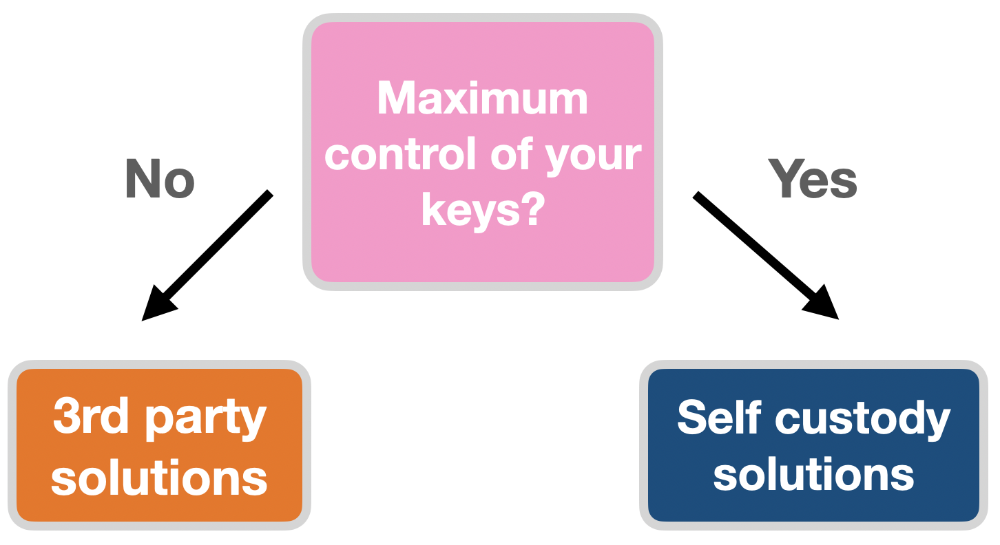
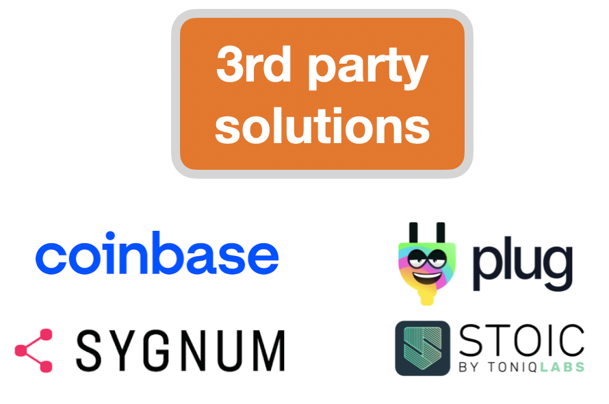
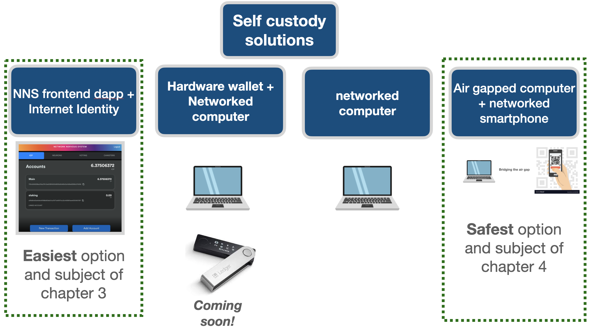

Warning: documentation in beta
{: .label .label-red }

{: .no_toc .text-delta }

1. TOC
{:toc}

* * *
# Options: Maximum ease or maximum control?

To stake, you have many options, each with different security and usability trade-offs. Choosing your setup is usually where people get most stuck. 

Below is a summary of the range of options availale to you depending on your comfort level.

*Fig. 1: staking options*

Examples if you prefer to have a third party custody your keys.

*Fig. 2: third party solutions*

Examples if you prefer to have maximum control of your keys.

*Fig. 3: self-custody staking options*

**This documentation is for people who choose self-custody.**

This chapter summarizes your self-custody options from **easiest** to **safest**.

* * *
## Maximum Ease Option

 Use [Internet Identity](https://medium.com/dfinity/internet-identity-the-end-of-usernames-and-passwords-ff45e4861bf7) with the [NNS frontend dapp](https://nns.ic0.app/)

### Traits

* Most convenient. Entirely web-based. No need to download or install anything.
* [NNS frontend dapp](https://nns.ic0.app/) has all the functionality you need
* This is a very common method
* Ideal for people who want to want the easiest path to control their ICP

If you choose this, go to [Chapter 3: Easiest staking option](../3-easiest-staking-option/3-easiest-staking-option.md)

* * *
## Maximum Control Option

Use your `seed phrase` directly with a few options for self-custody tools.

### Traits

* This option requires more technical understanding 
* You have most control over your ICP.
* This is the *safest* option from a software point of view because you are relying on less software surface area, but it is the *riskiest* from a human point of view in that it puts the risk of your `seed phrase` and `private key` custody on you.
* Ideal for people who want as much control over their ICP as possible

If you choose this, go to [Chapter 4: Safest staking option](../4-safest-staking-option/4-safest-staking-option.md)

   
