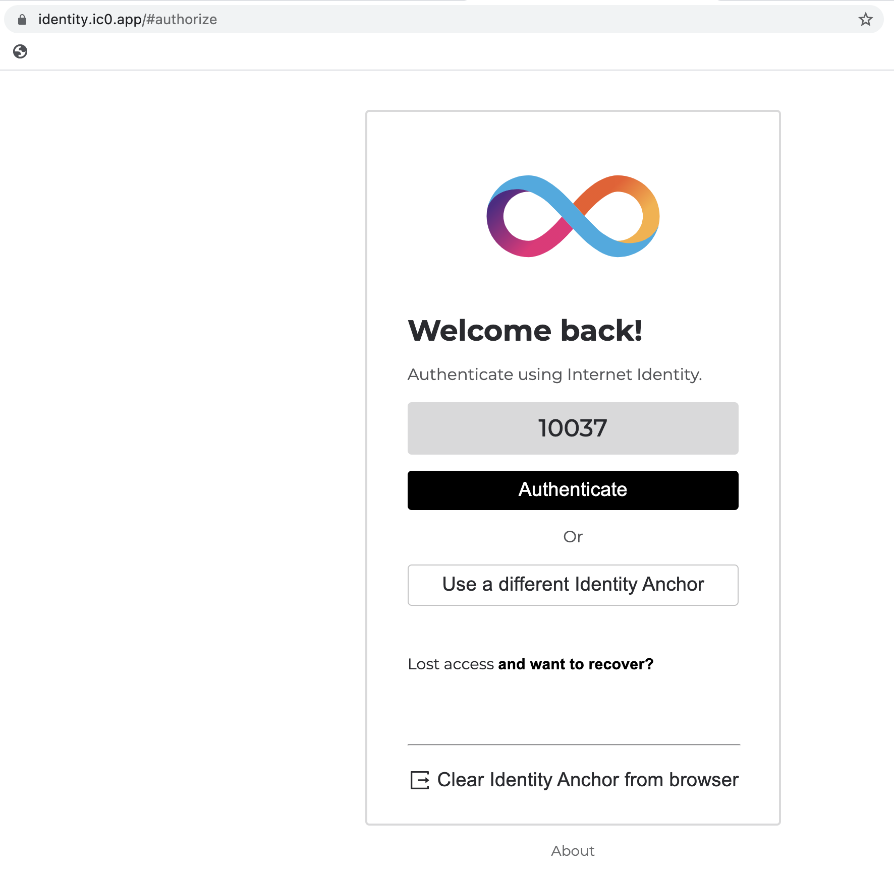
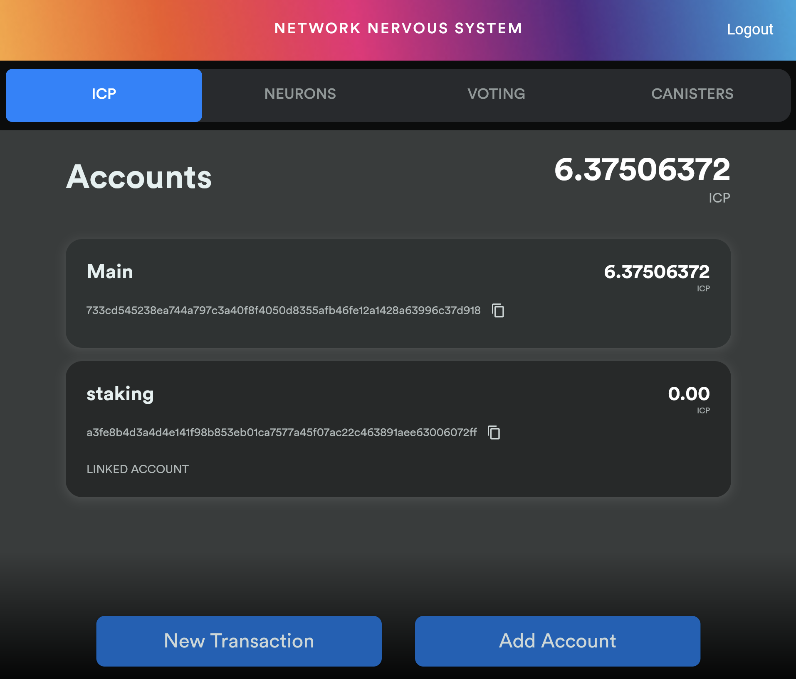

# 2. Tool options

To stake, you have many options, each with different security and usability trade-offs. Choosing your setup is usually where people get most stuck. 

This chapter summarizes your options from **easiest** to **safest**.

## Easiest Option

 Use [Internet Identity](https://medium.com/dfinity/internet-identity-the-end-of-usernames-and-passwords-ff45e4861bf7) with the [NNS frontend dapp](https://nns.ic0.app/)

   ### Traits

    - Most convenient. Entirely web-based. No need to download or install anything.
    - NNS Dapp has all the functionality you need
    - This is a very common method
    - Ideal for people who want to want the easiest path to control their ICP

    ### Internet Identity                                                        

    

    ### NNS Frontend Dapp

    

## Safest Option

Use your `seed phrase` directly with a few options for self-custody tools.

### Traits

    - This option is requires more technical understanding 
    - This is the *safest* option from a software point of view because you are relying on less software surface area, but it is the *riskiest* from a human point of view in that it puts the risk of your `seed phrase` custody on you.
    - Ideal for people who want as much control of their ICP as possible

   