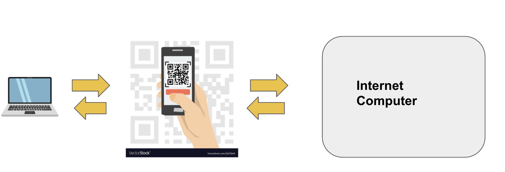
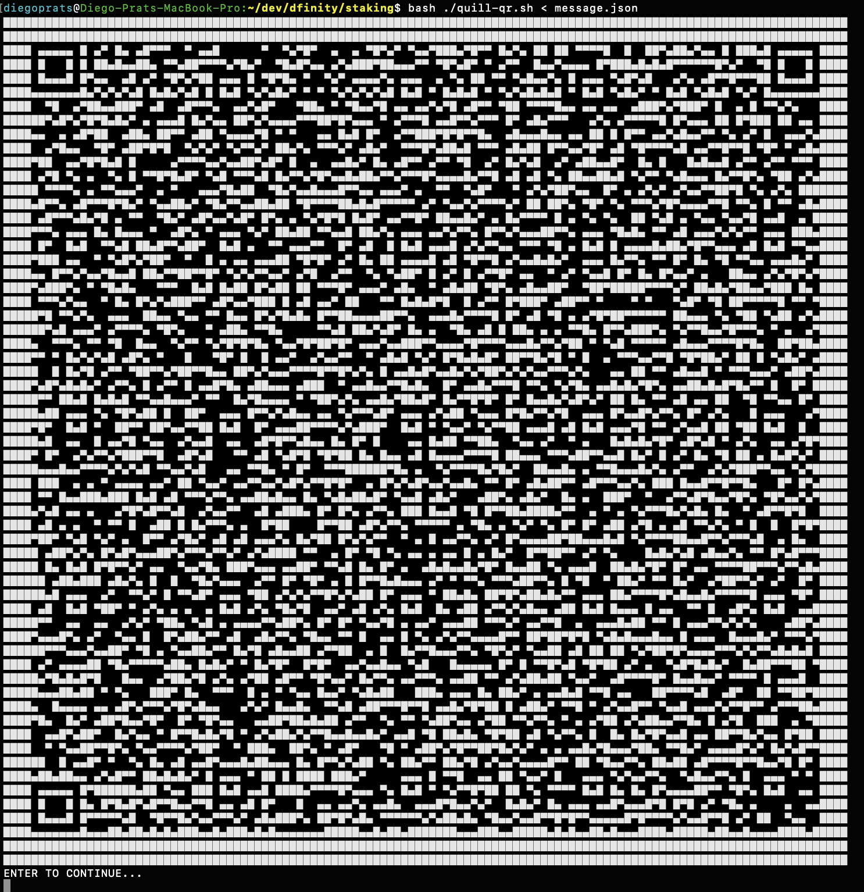
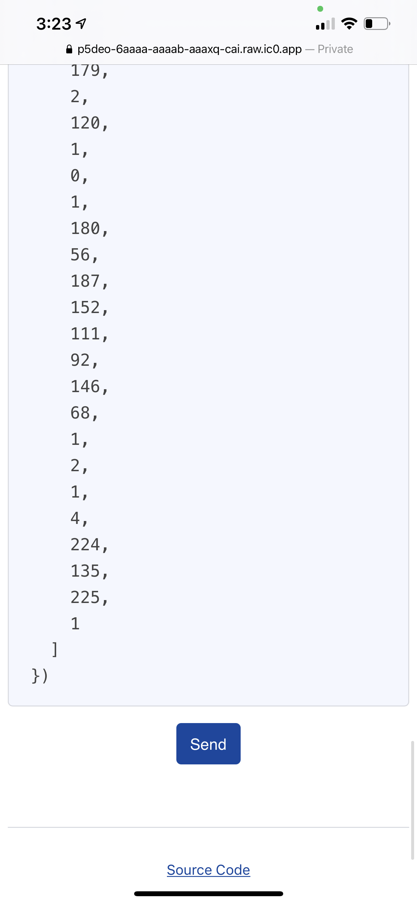
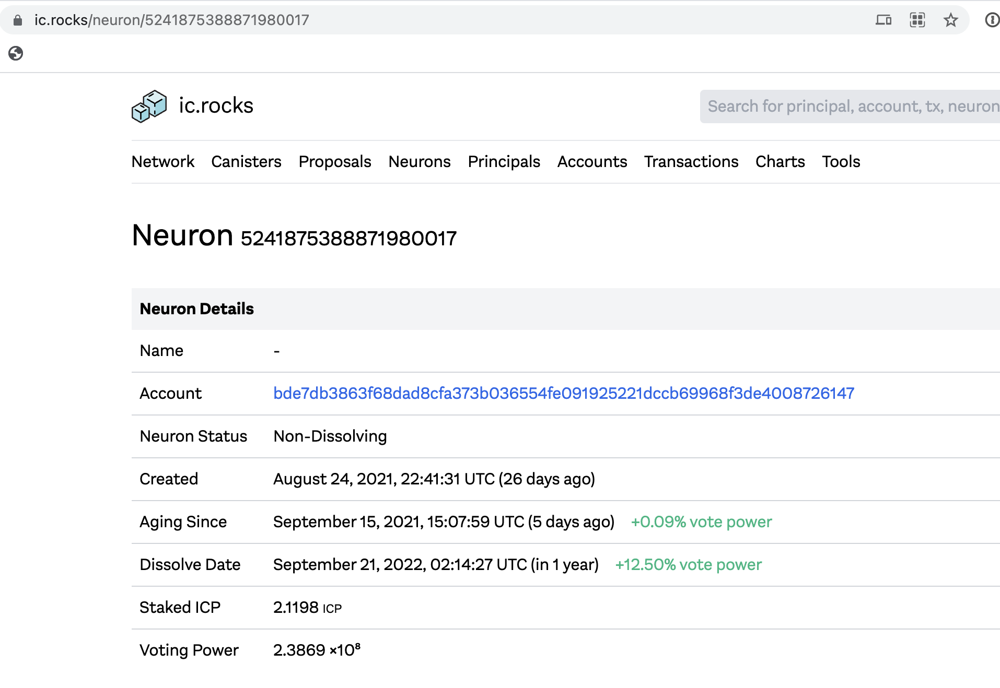

## 4.2 Create a **neuron** with a **dissolve delay**

*This step would only happen once 1️⃣ per neuron.*

**Note**: *To “stake ICP” and to “create a neuron” are the same activity so they are used interchangeably.*

This section assumess you succesffully installed the the QR tools on your **air-gapped computer** from 4.0.

In this section, we need to "bridge the air gap." This means that we will continue to perform the ***sensitive*** operations within the **air-gapped computer**, but we will use a **networked smartphone**'s QR code scanner to send the messages *from* **the air-gapped computer** *to the* Internet Computer.



### 4.2.1 Send ICP to the `ledger account number` created in previous chapter

This account number lives in the Ledger canister that maintains the ICP addresses for the entire network. This account number is analogous to "addresses" in other blockchains. You need to send the ICP you want to stake to the `ledger account number`. In our case, the `ledger account number` from 4.1 was `77b5eb9a465f4ce6f4da494ee2bfedeefe0b52d106e0272556c1ad991f99e3da` so that is what we woud use.

To create a neuron, you need to stake a minimum of 1 ICP. Anything lesss will *not* successfully create a neuron.

**If you cannot send ICP to your ledger account number, do not continue.** Try again, check out support, or submit a question to support.

### 4.2.2 Generate a signed message to "create a neuron" using `quill`


You will use `quill`'s  `neuron-stake` command of the form:

```jsx
// This is just the structure, copy/pasting WILL NOT work. See below for working command
quill --pem-file private.pem neuron-stake --name $NAME --amount $AMOUNT
```

For this command, the `$NAME` is an arbitrary string, **up to 8 characters**, that you can use to identify your neuron for the purposes of topping up later with `quill`. For example, if you intend to have only one eight-year neuron, you could use the name `8yneuron`. This string has no meaning otherwise, and will not be visible anywhere else. **You should store this.**

The `$AMOUNT` should not include the transaction fee, but remember that it will still be deducted from your account, so if you wish to stake everything you've got, stake your balance minus the 0.0001 ICP fee.

Here is the same command with the fields `$NAME` (“neuron3”) and `$AMOUNT` (1.01) filled out. 

**You should choose your own fields.**

Inside the **air-gapped computer**:

```bash
// Create the message that tells IC "create the neuron" and save it "message.json"
$ quill --pem-file private.pem neuron-stake --name neuron3 --amount 1 > message.json
```

### 4.2.3 Send the message to the Internet Computer using a QR code

Since your **air-gapped computer** is not connected to the internet, we will use a **QR app** to send the message generated in 2.1 to the Internet Computer. We will use `IC Transaction Scanner` which lives in a canister (and whose code is visible here: [https://github.com/ninegua/ic-qr-scanner](https://github.com/ninegua/ic-qr-scanner))


**4.2.3a Convert the `message.json` into QR codes**

`message.json` file actually has multiple messages for the Internet Computer, so you will run a script that will put you in the following loop:

1. You run script
2. QR code is generated
3. You scan QR code with your smartphone
4. Hit ENTER and return to step 2

Copy the bash script you will use: [https://github.com/IvanMalison/quill-qr/blob/master/quill-qr.sh](https://github.com/IvanMalison/quill-qr/blob/master/quill-qr.sh)

```bash
// Using "message.json", create QR codes you can scan with your phone
$ bash ./quill-qr.sh < message.json
```

The command will break up all the messages in `message.json` into QR codes you will sca sequentially in step 2.2




**4.2.3b Navigate your smartphone to `IC Transaction Scanner`** **and scan the QR code**: 

**4.2.3c** URL for **`IC Transaction Scanner`:** [https://p5deo-6aaaa-aaaab-aaaxq-cai.raw.ic0.app](https://p5deo-6aaaa-aaaab-aaaxq-cai.raw.ic0.app/)

**4.2.3d** Scan QR code on your terminal with your smartphone and send it to the IC

**Scan code**

<!--  -->


**Press `Send` to send message to the Internet Computer**

<!--  -->


**4.2.3e** Press ENTER on terminal

🎉🎉 **Success**! ***Neuron created!*** 🎉🎉

You will get a response on  **`IC Transaction Scanner`** that confirms the neuron was successfully created. ****You will get a `neuron id`. A `neuron id` will look come back to you as a response that looks like this:

```jsx
(
  record {
    result = opt variant {
      NeuronId = record { id = 5_241_875_388_871_980_017 }
    };
  },
)
```

In the example above, the neuron id is `5241875388871980017`

You can view your neuron on community dashboards like [ic.rocks](http://ic.rocks) by going to URL: [https://ic.rocks/neuron/](https://ic.rocks/neuron/3028){{neuron-id}}

For example, neuron `5241875388871980017` [https://ic.rocks/neuron/5241875388871980017](https://ic.rocks/neuron/5241875388871980017)




### 4.2.4 Send a message to the neuron to “start dissolve delay”

To increase the dissolve delay of a neuron whose id is `$NEURON_ID`, we will use a command of the form:

```bash
// This is just the structure, copy/pasting WILL NOT work. See below for working command
$ quill --pem-file private.pem neuron-manage $NEURON_ID --additional-dissolve-delay-seconds $SECONDS
```

This shows the `neuron-manage` subcommand, which is used to manipulate neurons after they have been staked as in **4.2.2**. In this case, we are adding `$SECONDS` seconds to the delay time.

The following table gives typical values for `$SECONDS`:

- Six months: 15778800
- One year: 31557600
- Four years: 126230400
- Eight years: 252460800

In our example, we will start a **1-year dissolve**, so we will use `quill` to craft the following command:

**Inside air-gapped computer**

```bash
// Add the dissolve delay
$ quill --pem-file private.pem neuron-manage 5241875388871980017 --additional-dissolve-delay-seconds 31557600 > message.json

// Using "message.json", create QR codes you can scan with your phone
$ bash ./quill-qr.sh < message.json
```

Open file `message.png.`Send the message to the Internet Computer by scanning `message.png` with **`IC Transaction Scanner`** on your phone as in **4.2.3**


By now we should have the following:

| Artifact | Example | Security| Final outcome|
| ------------- | ------------- |
| `seed phrase` | `stove reject elder top dentist car suit license grid uncle ape wash`| • If someone has this, they can take your tokens. <br /> • If you lose it, you can lose access to your ICP. <br /> • You can keep this if you want to be able to generate your private key again. | • You created this via Keysmith in this section in 4.1.1.  <br />• You will have properly stored in 4.1.4<br />• You deleted this from your computer in 4.1.5|
| `private key` | ```-----BEGIN EC PARAMETERS----- ``` (and continues...) | • If someone has this, they can take your tokens. <br /> • If you lose it, you can recreate from seed phrase <br /> | • You created this via Keysmith in this section in 4.1.2. |
| `ledger account number` | `77b5eb9a465f4ce6f4da494ee2bfedeefe0b52d106e0272556c1ad991f99e3da`| • If someone has this, they can view your token balance. <br /> • If you lose it, you can go through steps to get it back with your private key. | • You generate this in 1.3. This can be stored anywhere.|
| `neuron id` | `5241875388871980017`| • If someone has this, they can see your balance.  <br /> • If you lose this, you can reconstruct it. | • You generated this in 4.2.2. This can be stored anywhere.|
| `neuron name` | `neuron3` | • If someone has this, it gives them nothing.<br /> • If you lose this, you can get it back. | • You generated this in 4.2.3. This can be stored anywhere.
