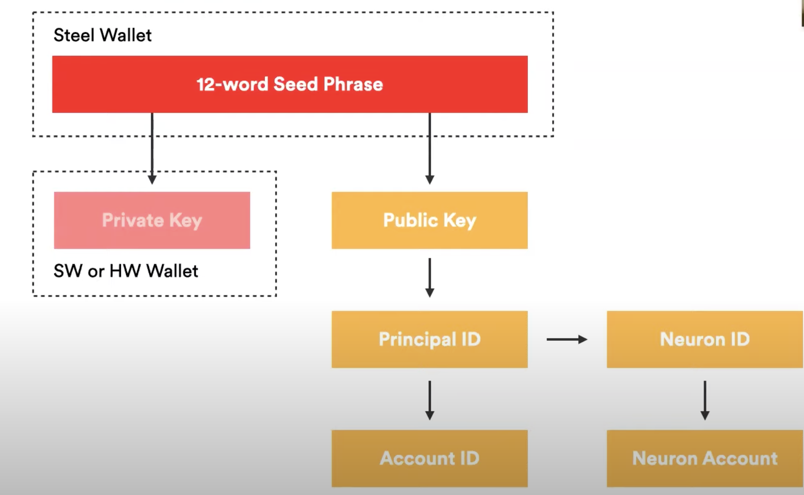

Warning: documentation in beta
{: .label .label-red }

{: .no_toc }

{: .no_toc .text-delta }

1. TOC
{:toc}

* * *
# Safest option: How to stake

This chapter is for people who want to have as much control of their ICP as possible by custodying their own `seed phrase` and do not mind more technical hurdles to have maximum control. 

* * *
## The three steps to stake

As a reminder, there are three basic steps (whose implementation depend on the technology you choose):

**1. Generate a private key** 

*This step would only happen once 1️⃣ per cold wallet. For most people, this means you will do this step only once.*

**2. Create a neuron with a dissolve delay** 

*This step would only happen once 1️⃣ per cold wallet. For most people, this means you will do this step only once.*

**3. *Optional*: Add more ICP to the Neuron (“top up the neuron”)**

*This step could happen many times 🔁 per neuron.*

This chapter explains how to accomplish these steps given one self-custodies their own `seed phrase`.

* * *
## The Risks involved

There are various artifacts that can be derived from your `seed phrase`. The diagram below explains which are derived and the risks from each artifact.

### Red Boxes

* 12-word `seed phrase`
* `Private key`

If you lose these, you lose access to your ICP

If someone gets these, they may take your ICP

### Yellow Boxes

* `Public Key`
* `Principal`
* `Neuron Id`
* `Account Id`
* `Neuron Account`

If you lose these, you can regenerate them from your `seed phrase`

If someone gets these, they can see how ICP you have or your transactions

* * *
## Decisions you need to make

### 1. Where to store your `seed phrase`?

Do **NOT** store your seed phrase electronically. We recommend you store in any of the following options:

a. Paper

b. Steel wallets like [Billfodl](https://privacypros.io/products/the-billfodl/)

### 2. Once you have your `seed phrase`, what **tools** can you stake with?

Right now, your safest option is:

**Air gapped** computer + **networked** phone

You will use the **air-gapped computer** to create and sign messages *which it cannot send since the computer* is air-gapped. These messages will be turned into QR codes. You will use a **networked smartphone** to "bridge the air gap" by reading QR codes from the **air-gapped computer** and sending them directly to the Internet Computer. The worst-case scenario is that the phone does not send the messages, but the phone never gets access to anything sensitive.

Soon, you will have *another* option: **[Ledger Nano](https://shop.ledger.com/products/ledger-nano-x) integration**

You can see a [preview here of how it will work](https://www.youtube.com/watch?v=YefRR6O-xjg)

