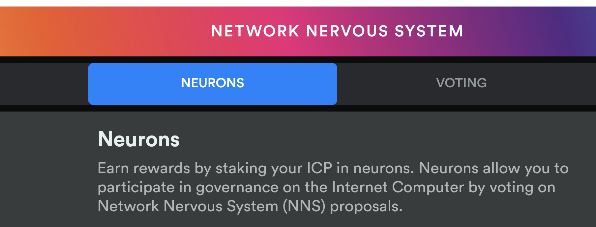

Warning: documentation in beta
{: .label .label-red }

# 5.4  Adding a Hot Key

A hot key is a lot like a read-only view of a neuron, in that it lets you use a different controller to see the balance, maturity, dissolve delay and other details of a neuron. Where this becomes most useful is in conjunction with the [NNS frontend dapp](https://nns.ic0.app/) and your [Internet Identity](https://identity.ic0.app/).

a. If you chose the **maximum ease staking option**...   you do not need this, you can already view it on the [NNS frontend dapp](https://nns.ic0.app/).

b. If you chose the **maximum control staking option**...

Log in to the [NNS frontend dapp](https://nns.ic0.app/) and visit the Neurons tab, it will display a Principal Id value at the top of that tab. 



Use that principal id with `quill` to establish the [NNS frontend dapp](https://nns.ic0.app/) as a hot key for your neuron:
	
Structure of command:
```bash
$ target/release/quill --pem-file private.pem neuron-manage $NEURON_ID --add-hot-key "$PRINCIPAL"
```

Command with example variables: 
```bash
// Add the hot key from the NNS frontend dapp to your self-custodied neuron
$ target/release/quill --pem-file private.pem neuron-manage 5241875388871980017 --add-hot-key "2xt3l-tqk2i-fpygm-lseru-pvgek-t67vb-tu3ap-k0mnu-dr4hl-z3kpn-o2e" > message.json

// Using the bash script, create a QR code from the "message.json" file created by quill with your message
$ bash ./quill-qr.sh < message.json
```


Now refresh the [NNS frontend dapp](https://nns.ic0.app/) in your browser, and you should see your Neuron displayed. You may change the followees and topics for the neuron now in the NNS App interface, but will not be able to dissolve, disburse or spawn.
